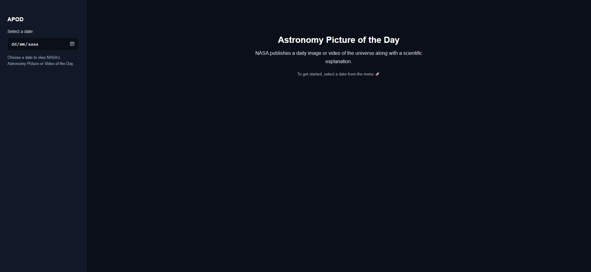
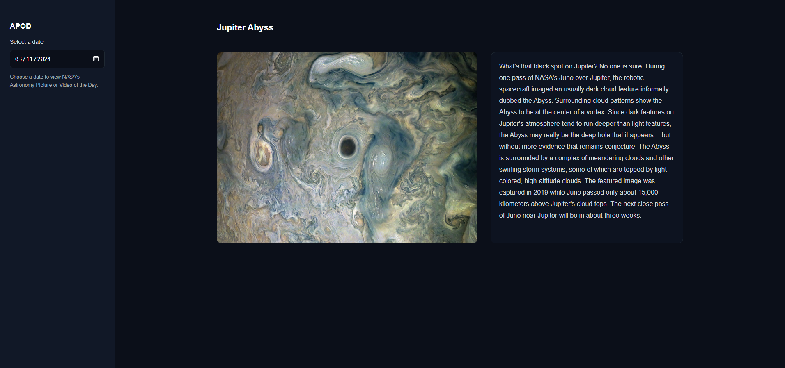
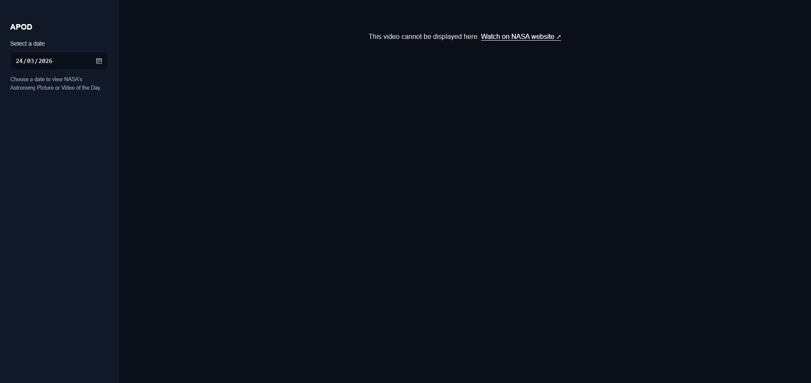

> 🇧🇷 [Versão em Português](./README.pt-br.md)

# 🌌 NASA APOD Viewer


\

> A small project focused on **UI state management, API edge cases, and resilient user experience**.

---

## 🔗 Live Demo

👉 https://apod-viewer-sigma.vercel.app/

---

## 🖼️ Preview

 







---

## 🎯 About the Project

This application consumes NASA’s APOD API and allows users to explore space content by date.

The focus of this project was not just displaying data, but handling **real-world API inconsistencies** while maintaining a clean and predictable UI.

---

## 🛰️ NASA APOD API

This project integrates with the NASA Astronomy Picture of the Day (APOD) API to retrieve daily space media and metadata.

**Key aspects:**

* REST endpoint with query parameters (`date`, `api_key`)
* Returns different media types (`image`, `video`)
* Some video URLs **cannot be embedded** due to browser security restrictions (X-Frame-Options)
* Requires defensive handling of missing or inconsistent data

**Endpoint:**

```
https://api.nasa.gov/planetary/apod
```

For development and portfolio purposes, the app uses the public `DEMO_KEY`.

> ⚠️ In real-world applications, API keys should never be exposed on the client side. A backend proxy or environment variables should be used instead.

---

## ⚙️ Tech Stack

* HTML5
* CSS3 (Mobile-first, Grid/Flexbox)
* Vanilla JavaScript (ES6+)
* Fetch API

---

## 🧠 Technical Highlights

### 1. Explicit UI State Management

The application is built around clearly defined UI states:

* `welcome`
* `loading`
* `result`
* `error`
* `video-unavailable`

Each state is handled explicitly to prevent UI conflicts and ensure predictable behavior.

---

### 2. Handling API Edge Cases (Video Fallback)

The NASA API may return videos that **cannot be embedded** in an `<iframe>`.

Instead of failing silently, the app:

* Detects embeddable vs non-embeddable URLs
* Displays a fallback message
* Provides a direct link to view the content externally

This ensures a consistent user experience even when the API behaves unpredictably.

---

### 3. Media Type Handling

* Images → rendered with ``
* Videos → rendered with `<iframe>`
* Non-embeddable videos → handled via fallback UI

Before rendering, the UI is always cleaned to avoid leftover state (`clearResult`).

---

### 4. Defensive Programming

* Prevents future dates
* Prevents dates before APOD availability (June 16, 1995)
* Handles API failures gracefully
* Provides fallback content/messages

---

### 5. Separation of Concerns

The code is structured into clear responsibilities:

* Data fetching → `fetchApod`
* UI rendering → `showResult`, `showError`
* State control → `setLoading`, `resetUI`
* Edge case handling → `showVideoUnavailable`

---

## 🚀 Getting Started

Clone the repository:

```
git clone https://github.com/douglas-andre/apod-viewer.git
```

Open:

```
index.html
```

---

## 📌 Future Improvements

* Persist last selected date (localStorage)
* Add "Today" shortcut
* Improve video URL normalization (YouTube, etc.)
* Add animations/transitions

---

## 👨‍💻 Author

Douglas André

---

## 📄 License

Educational project
